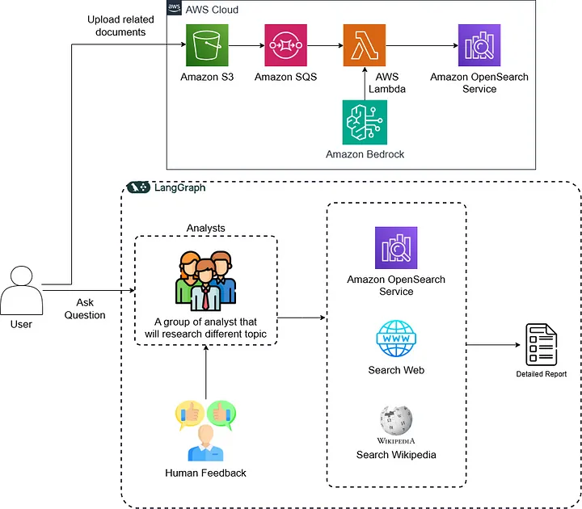

# 🤖 Intelligent Data Service

## Original Work

Github: https://github.com/JoshuaC215/agent-service-toolkit/

[](https://github.com/JoshuaC215/agent-service-toolkit/actions/workflows/test.yml) [](https://codecov.io/github/JoshuaC215/agent-service-toolkit) [](https://github.com/JoshuaC215/agent-service-toolkit/blob/main/pyproject.toml)
[](https://github.com/JoshuaC215/agent-service-toolkit/blob/main/LICENSE) [](https://agent-service-toolkit.streamlit.app/)

A full toolkit for running an AI agent service built with LangGraph, FastAPI and Streamlit.

It includes a [LangGraph](https://langchain-ai.github.io/langgraph/) agent, a [FastAPI](https://fastapi.tiangolo.com/) service to serve it, a client to interact with the service, and a [Streamlit](https://streamlit.io/) app that uses the client to provide a chat interface. Data structures and settings are built with [Pydantic](https://github.com/pydantic/pydantic).

This project offers a template for you to easily build and run your own agents using the LangGraph framework. It demonstrates a complete setup from agent definition to user interface, making it easier to get started with LangGraph-based projects by providing a full, robust toolkit.

## Overview

### Architecture Diagram



## Why LangGraph?

AI agents are increasingly being built with more explicitly structured and tightly controlled [Compound AI Systems](https://bair.berkeley.edu/blog/2024/02/18/compound-ai-systems/), with careful attention to the [cognitive architecture](https://blog.langchain.dev/what-is-a-cognitive-architecture/). At the time of this repo's creation, LangGraph seems like the most advanced open source framework for building such systems, with a high degree of control as well as support for features like concurrent execution, cycles in the graph, streaming results, built-in observability, and the rich ecosystem around LangChain.

I've spent a decent amount of time building with LangChain over the past year and experienced some of the commonly cited pain points. In building this out with LangGraph I found a few similar issues, but overall I like the direction and I'm happy with my choice to use it.

With that said, there are several other interesting projects in this space that are worth calling out, and I hope to spend more time building with them soon:

- [LlamaIndex Workflows](https://www.llamaindex.ai/blog/introducing-workflows-beta-a-new-way-to-create-complex-ai-applications-with-llamaindex) and [llama-agents](https://github.com/run-llama/llama-agents): LlamaIndex Workflows launched the day I started working on this. I've generally really liked the experience building with LlamaIndex and this looks very promising.
- [DSPy](https://github.com/stanfordnlp/dspy): The DSPy optimizer and approach also seems super interesting and promising. But the creator [has stated](https://github.com/stanfordnlp/dspy/issues/703#issuecomment-2016598529) they aren't focusing on agents yet. I will probably experiment with building some of the specific nodes in more complex agents using DSPy in the future.
- I know there are more springing up regularly, such as I recently came across [Prefect ControlFlow](https://github.com/PrefectHQ/ControlFlow).

### Contributing

Currently the tests need to be run using the local development without Docker setup. To run the tests for the agent service:

1. Ensure you're in the project root directory and have activated your virtual environment.

2. Install the development dependencies and pre-commit hooks:

   ```sh
   pip install uv
   uv sync --frozen
   pre-commit install
   ```

3. Run the tests using pytest:

   ```sh
   pytest
   ```

## Customization

To customize the agent for your own use case:

1. Add your new agent to the `src/agents` directory. You can copy `research_assistant.py` or `chatbot.py` and modify it to change the agent's behavior and tools.
1. Import and add your new agent to the `agents` dictionary in `src/agents/agents.py`. Your agent can be called by `/<your_agent_name>/invoke` or `/<your_agent_name>/stream`.
1. Adjust the Streamlit interface in `src/streamlit_app.py` to match your agent's capabilities.
